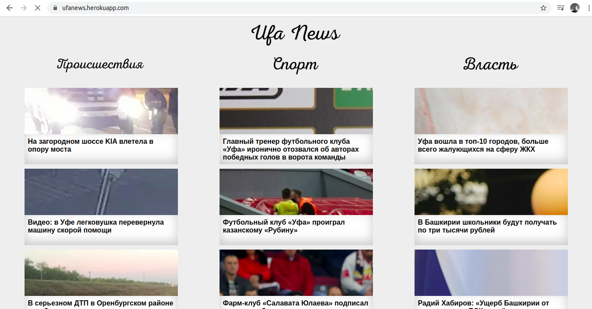

### Ufa news

(https://ufanews.herokuapp.com)  

Приложение проводит сбор RSS feed региональных новостных веб-сайтов,
определяет тематику статей с помощью нейронных сетей:

- Support Vector Machine — **SVM** (`gem 'libsvm'`);
- Fast Artificial Neural — **FANN** (`gem 'fann'`).

Качество классификации: **86,91%** (SVM); **63,64%** (FANN).
 
Сохраняются для отображения статьи, соответствующие следующим категориям:

- «Дорожно-транспортные происшествия»;
- «Спорт»;
- «Власть».

Используемые RSS-источники:
- Городской интернет-портал UTV.RU ([utv.ru/rss.xml](https://utv.ru/rss.xml));
- Российская Газета Башкортостан ([rg.ru/org/filial/bashkortostan/rss.xml](https://rg.ru/org/filial/bashkortostan/rss.xml));
- Коммерсантъ Уфа ([kommersant.ru/rss/regions/ufa_all.xml](https://www.kommersant.ru/rss/regions/ufa_all.xml)).  

Содержание папок:
- **1_analyze** (обучение нейросетей):
  - собранные новостные статьи;
  - анализ частот появления слов;
  - списки ключевых слов;
  - обучение нейросетей и тестирование их работы.
- **2_rails_project/ufa_news** (rails-приложение).

Модуль **TextProcessable** предназначен для нормализации текстового
содержания анализируемых статей.  

Классы **SVMRecognizer** и **FANNRecognizer** — классы обученных нейронных
сетей **SVM** и **FANN** соответственно.

---
@mirat1618, 2020.

        
